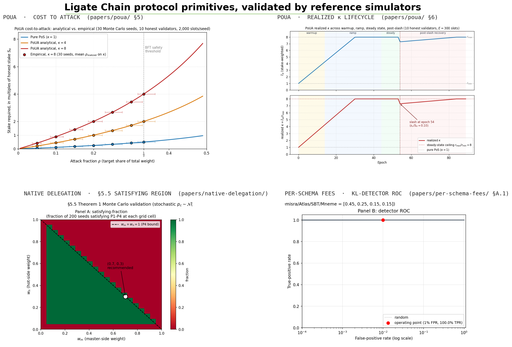

# Ligate Research

Public research artifacts from Ligate Labs: working papers, formal specifications, and reference simulators for protocol primitives that ship in [Ligate Chain](https://github.com/ligate-io/ligate-chain) and adjacent projects.

This repository is the upstream of the technical claims our marketing surface (ligate.io, ligate.io/docs) makes. If a claim about consensus, fee markets, attestation composition, delegation, or any other protocol-level design decision appears on the marketing site, the corresponding paper or spec lives here.



> Headline figures from the three reference simulators that ship in this repo. Top row: PoUA empirical-vs-analytical cost-to-attack at $\kappa \in \{1, 4, 8\}$ ([`papers/poua/`](papers/poua/) §5) and realized $\kappa$ across warmup → ramp → steady → post-slash recovery ([`papers/poua/`](papers/poua/) §6). Bottom row: native-delegation Theorem 1 satisfying region with the recommended $(w_m, w_h) = (0.7, 0.3)$ operating point ([`papers/native-delegation/`](papers/native-delegation/) §5.5) and the per-schema-fees KL-divergence cheating detector at 100% TPR / 1% FPR ([`papers/per-schema-fees/`](papers/per-schema-fees/) §A.1). Composed by [`scripts/build_portfolio_overview.py`](scripts/build_portfolio_overview.py); see each paper directory for the underlying derivations and the rest of the empirical figures.

## What's in scope

- **Working papers**: design documents for novel protocol primitives, written at a level appropriate for academic and engineering review (`papers/`)
- **Reference simulators**: Python prototypes that exercise the mechanisms papers describe, used for parameter calibration and empirical validation of paper claims (`prototypes/`)
- **Specification drafts**: formalized specifications that bridge papers and the engineering RFCs in `ligate-chain/docs/protocol/rfcs/` (in `papers/` alongside the corresponding paper)

## What's NOT in scope

- Production code (lives in `ligate-chain`)
- Marketing copy or vision documents (live in `ligate-marketing`, public via ligate.io)
- Engineering tickets (filed in the relevant repo's GitHub issues)

## Current papers

| Paper | Status | Latest version | Topic |
|---|---|---|---|
| [Proof of Useful Attestation (PoUA)](papers/poua/) | Working paper, [arXiv:2605.25844](https://arxiv.org/abs/2605.25844) | v0.9.2 (2026-05-25) | Consensus weighting primitive that aligns validator influence with valid attestation work |
| [Native Delegation](papers/native-delegation/) | Working paper | v0.2 (2026-05-25) | Hot-key / master-key separation as a runtime primitive (Iris foundation) |
| [Per-Schema Fee Markets](papers/per-schema-fees/) | Working paper | v0.2 (2026-05-25) | EIP-1559-style per-schema base fees with PoUA-coupled burn |
| [Cross-Schema Composition](papers/cross-schema-composition/) | Working paper | v0.2 (2026-05-25) | Typed attestation references with slashing-aware proof propagation |
| [Time-Locked Attestations](papers/time-locked-attestations/) | Working paper | v0.2 (2026-05-25) | Commit-reveal as a runtime primitive |
| [Native DA Layer](papers/native-da/) | Working paper | v0.2 (2026-05-25) | A native DA layer specialized for the attestation workload (post-Celestia track) |
| [Schema-Bound Tokens](papers/schema-bound-tokens/) | Research note | v0.2 (2026-05-25) | Attestor sets as mint authority on attestation-native chains |
| [Cross-Chain Attestation Portability](papers/cross-chain-portability/) | Working paper | v0.2 (2026-05-27) | Unified IBC-style light-client proof primitive consolidating five cross-chain extensions |
| [AVOW Tokenomics](papers/tokenomics/) | Working paper | v0.4 (2026-05-27) | Bootstrap block reward, fee-coupled burn, path to fee-driven steady state, parameter sensitivity tables |
| [EAS Comparison](papers/eas-comparison/) | Working paper | v0.2 (2026-05-27) | Ligate Chain vs Ethereum Attestation Service |
| [C2PA Co-existence](papers/c2pa-composition/) | Working paper | v0.2 (2026-05-27) | Chain attestation as adversarially-robust companion to platform metadata |
| [TEE Composition](papers/tee-composition/) | Working paper | v0.2 (2026-05-27) | Hardware attestation as typed input to chain attestations |
| [PQ Migration](papers/pq-migration/) | Working paper | v0.2 (2026-05-27) | Post-quantum cryptographic migration for attestation-native chains |
| [Themisra Licensing Schemas](papers/themisra-licensing-schemas/) | Working paper | v0.2 (2026-05-27) | Prompt + content licensing schemas riding on Proof of Prompt |
| [Verifiable Content Provenance](papers/verifiable-content-provenance/) | Working paper | v0.2 (2026-05-27) | Detection, embedding, and watermarking for the Ligate receipt layer |

## Reading and contributing

These are working papers. They are public so that external review, critique, and collaboration are possible, not because they are finished. Each paper carries an explicit version history and a `STATUS` line in its title block. Drafts are marked as such; do not cite a v0.x paper as a finished result.

Issues and pull requests are welcome:

- For substantive technical critique on a paper, please open an issue with the paper name in the title (e.g., `[poua] question about §5.5 A3 detection bound`)
- For typos or small wording fixes, send a PR directly
- For larger structural revisions, open an issue first to discuss

We do not expect external contributors to author full papers in this repo at this stage. Once the research direction stabilizes (mid-2026 onward), we anticipate opening up authorship more broadly.

## License

- **Papers** (everything under `papers/`): [Creative Commons Attribution 4.0 International (CC-BY-4.0)](LICENSE-CC-BY-4.0). You may share and adapt with attribution.
- **Code** (everything under `prototypes/` and any other code in this repo): [Apache License 2.0](LICENSE-APACHE-2.0).

## Contact

Substantive feedback: hello@ligate.io with `[research]` in the subject line.

GitHub Discussions for open questions: https://github.com/ligate-io/ligate-research/discussions

## Repository structure

```
ligate-research/
├── README.md                            # This file
├── LICENSE-CC-BY-4.0                    # Papers
├── LICENSE-APACHE-2.0                   # Code
├── CONTRIBUTING.md                      # How to engage
├── CLA.md                               # Contributor License Agreement
├── figures/
│   └── portfolio-overview.png           # Hero montage (composed)
├── scripts/
│   ├── build_portfolio_overview.py      # Hero montage composer
│   └── check_citations.py               # Cross-paper citation linter
├── papers/
│   ├── README.md                        # Paper index
│   ├── CONSISTENCY_REVIEW.md            # Cross-paper consistency notes
│   ├── poua/                            # Proof of Useful Attestation (arXiv:2605.25844)
│   ├── native-delegation/               # Hot-key / master-key separation
│   ├── per-schema-fees/                 # EIP-1559-style per-schema fee market
│   ├── cross-schema-composition/        # Typed attestation references
│   ├── time-locked-attestations/        # Commit-reveal as runtime primitive
│   ├── native-da/                       # Attestation-specialized DA layer
│   ├── schema-bound-tokens/             # Attestor sets as mint authority
│   ├── cross-chain-portability/         # Unified IBC-style portability primitive
│   ├── tokenomics/                      # AVOW supply trajectory + burn schedule
│   ├── eas-comparison/                  # Ligate vs Ethereum Attestation Service
│   ├── c2pa-composition/                # Chain attestation composed with C2PA
│   ├── tee-composition/                 # TEE attestation as typed input
│   ├── pq-migration/                    # Post-quantum migration plan
│   ├── themisra-licensing-schemas/      # Prompt + content licensing schemas
│   ├── verifiable-content-provenance/   # Detection + embedding + watermark layer
│   └── _template/
│       └── paper-template.md            # Template for new papers
└── prototypes/
    ├── poua-sim/                        # PoUA reference simulator (Python)
    ├── native-delegation-sim/           # Native-delegation §5.5 sweep
    └── per-schema-fees-sim/             # Per-schema-fees KL detector + convergence
```

Each paper directory follows the same layout: a `README.md` with the version-history and quick-read summary, the source `*.md` working paper, the compiled `*.pdf`, and any paper-local figures or appendices. The PoUA directory additionally hosts the shared `header-includes.tex` reused by every other paper at build time.
