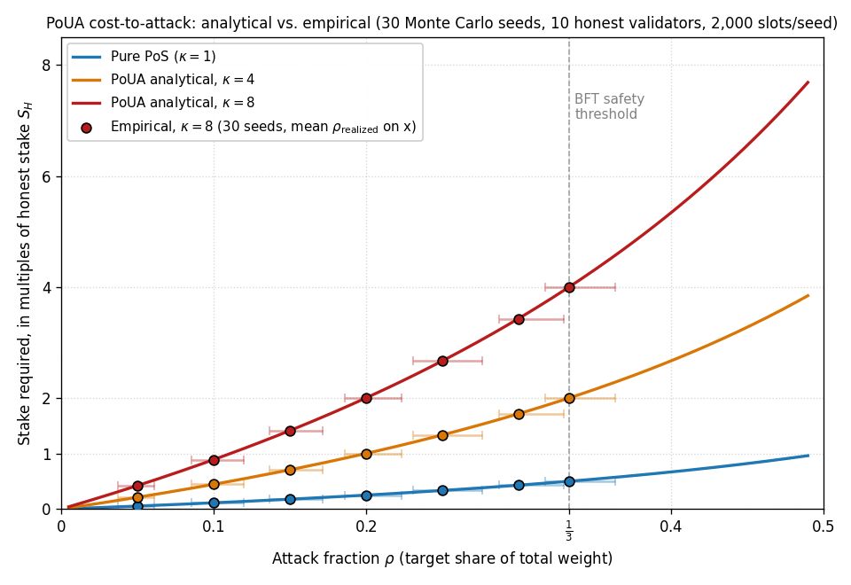
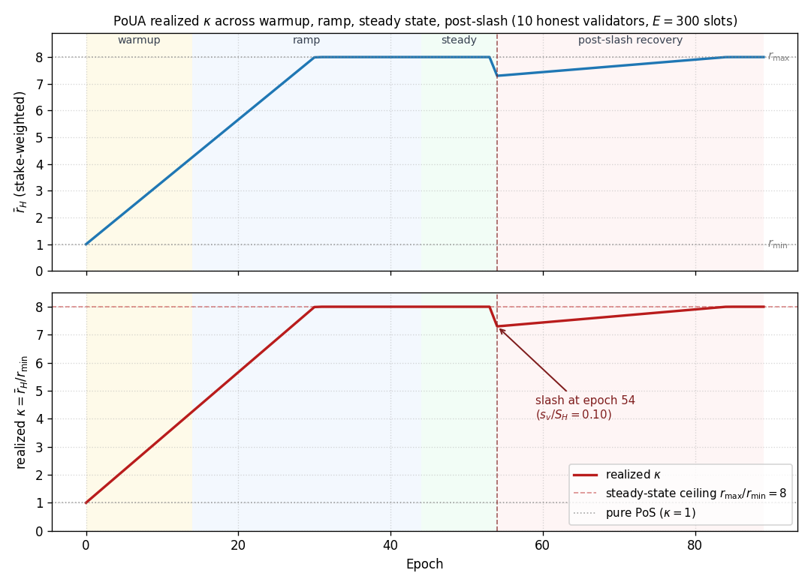
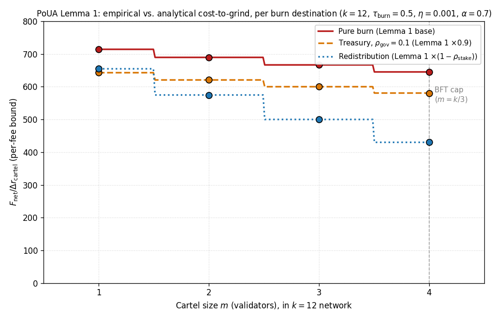

# Proof of Useful Attestation (PoUA)

A consensus weighting primitive for attestation-native chains.

## Figures

The simulator at [`prototypes/poua-sim/`](../../prototypes/poua-sim/) produces three headline figures, one per central security claim. All five M3-M5 figures live in [`prototypes/poua-sim/out/`](../../prototypes/poua-sim/out/); the three below are the ones the paper's body cites.



> **§5.3 cost-to-attack premium.** Empirical Monte Carlo points sit on analytical $\kappa \in \{1, 4, 8\}$ curves across $\rho \in \{0.05, 0.10, 0.15, 0.20, 0.25, 0.30, 1/3\}$. PoUA at $\kappa = 8$ requires $4.0 \, S_H$ at the BFT safety threshold ($\rho = 1/3$), versus pure-stake PoS's $0.5 \, S_H$. Generated by [`scripts/run_capital_scan.py`](../../prototypes/poua-sim/scripts/run_capital_scan.py).



> **§5.3.1 transition-state $\kappa$ envelope.** The realized cost-to-attack premium is a steady-state ceiling, not a guarantee. Warmup window holds $\kappa = 1$ for $T_{\text{warmup}}$ epochs; the ramp climbs to $r_{\max}/r_{\min} = 8$ over $T_{\text{ramp}}$; a slash event drops $\kappa$ by $(s_v / S_H) \cdot (r_{\max} - r_{\min})$ and recovers over the next ramp. Generated by [`scripts/run_kappa_trajectory.py`](../../prototypes/poua-sim/scripts/run_kappa_trajectory.py).



> **§5.5.3 cartel-aware Lemma 1, per burn destination.** Empirical $F_{\text{net}} / \Delta r_{\text{cartel}}$ matches analytical $\tau_{\text{burn}} / [\eta \cdot \alpha_{\text{eff}}(m, k)]$ for cartel sizes $m \in \{1, 2, 3, 4\}$ in a $k = 12$ network. Pure burn is the v0.6 default; redistribution weakens the bound by $(1 - \rho_{\text{stake}})$; treasury at 10% governance recovery weakens it by 10%. Generated by [`scripts/run_lemma1_scan.py`](../../prototypes/poua-sim/scripts/run_lemma1_scan.py).

## Latest

- **Working paper**: [`poua.pdf`](poua.pdf) (compiled) / [`poua.md`](poua.md) (markdown source) / [`poua.tex`](poua.tex) (LaTeX source for arXiv)
- **Version**: v0.9.1
- **Status**: Reviewer follow-up clarity pass on v0.8 + release-prep tightening; arXiv preprint in flight (cs.CR, pending endorsement)
- **Date**: 2026-05-25

## Abstract

Proof of Useful Attestation (PoUA) is a consensus weighting primitive in which validator influence is determined by the joint product of bonded stake and a non-transferable reputation score derived from successful participation in the chain's attestation workload. PoUA preserves the safety and liveness properties of standard BFT under partial-synchrony with $f < n/3$ Byzantine validators, and constructs a multiplicative cost-to-attack premium of $4\times$ to $10\times$ over equivalent pure-stake Proof of Stake chains.

The contribution is a synthesis of three existing lines of work, reputation-weighted consensus, proof-of-useful-work, and restaking with non-transferable bonds, applied to attestation-native chains, with a layered defense (formal protocol rules + economic disincentives + heuristic detection) against compound capital-plus-reputation-grinding adversaries.

## Building

From this directory:

```bash
pandoc poua.md -o poua.pdf \
  --pdf-engine=tectonic \
  --include-in-header=header-includes.tex \
  -V geometry:margin=1in \
  -V documentclass=article \
  -V fontsize=11pt
```

See the root [CONTRIBUTING.md](../../CONTRIBUTING.md) for tooling setup.

## Version history

- **v0.7.2** (2026-05-03): pre-review tightening pass on five known-but-fixable peripheral gaps before sending to the 25-person external reviewer roster. (1) §6.2 Nash equilibrium: enumeration extended to six named deviations (added free-riding voter, selective fork-choice gaming) with explicit acknowledgment that the full strategy-space search depends on simulator M6 ([#30](https://github.com/ligate-io/ligate-research/issues/30)). (2) §5.5.2 Layer 2 cost-to-evade: concrete lower bound `F_stage ≥ K · F_mixer · s_submitter` introduced, replacing the previous "real but harder to quantify" framing. (3) §11 Q4 RepuCoin differentiation: contrast sharpened along three axes (what reputation measures, where it enters consensus, what cost-to-grind argument relies on); externally-anchored vs intrinsically-anchored work is the load-bearing distinction. (4) §A.4 Erdős-Rényi null mismatch: promoted from passive acknowledgment to explicit subsection with calibration-issue-not-security-flaw framing. (5) §6.3 PV-of-slash formula: footnote on `s_v/S` static-weight-share approximation, direction of error (formula over-estimates deterrent), and bound on the gap. No new mechanisms; no new claims. Major substantive changes (η/λ rebase, M6 adversarial-agent results, devnet calibration) remain on the v0.8 roadmap.
- **v0.7.1** (2026-05-02): inline citation pass on prose numerical claims. Major prose claims in §1.5, §5.3, and §5.5.3 numerical-example block now reference their empirical generator script or test vector by path. Closes the paper-side discipline pass for [#23](https://github.com/ligate-io/ligate-research/issues/23); CI parser to validate the citations against actual files lives in a separate followup.
- **v0.7** (2026-05-02): empirical-validation pass. Embeds five reference-simulator figures: cost-to-attack with Monte Carlo overlay (§5.3), realized $\kappa$ trajectory across warmup / ramp / steady / post-slash (§5.3.1), Lemma 1 cartel + burn destinations (§5.5.3), volume-deterrent ratio (§6.3.1, new), A3 detector FPR under ER vs. scale-free Chung-Lu null (§A.4). New §4.4.1 makes the $\alpha$-$\beta$ Pareto frontier explicit (closes [#14](https://github.com/ligate-io/ligate-research/issues/14)). New §4.4.2 specifies the adaptive $\tau_{\text{burn}}$ rebase mechanism (telemetry surface + threshold-triggered rule + governance escalation; closes [#17](https://github.com/ligate-io/ligate-research/issues/17)). New §6.3.1 quantifies the volume-dependence of the slash deterrent (closes [#15](https://github.com/ligate-io/ligate-research/issues/15)). Cross-language test vectors at \texttt{prototypes/poua-sim/test\_vectors/} encode the analytical truths so the production implementation can re-validate (closes structural part of [#23](https://github.com/ligate-io/ligate-research/issues/23)).
- **v0.6.1** (2026-05-02): patch fix for Lemma 1 proof. Reference simulator (M2) revealed a discrepancy between the v0.6 Lemma 1 proof (which credited the proposer with own-block voter-channel reputation) and §4.3 of the same paper (which excludes the proposer from $G_v^{\text{vote}}$ on own-block per the explicit ``but did not propose'' rule). v0.6.1 corrects the proof to match §4.3 strictly, yielding $\alpha_{\text{eff}} = \alpha + (m-1)\beta/k$ instead of v0.6's $\alpha + m\beta/k$. The two formulas agree at $m = 1$ and at $k \to \infty$ at fixed $m/k$; at finite $k$ the v0.6.1 bound is slightly tighter (smaller $\alpha_{\text{eff}}$, larger $F^{\text{net}}$ floor). Numerical examples updated to distinguish the asymptotic and finite-$k$ cases. Empirically validated by simulator at $m \in \{1, 2, 3, 4\}, k = 12$ to floating-point precision.
- **v0.6** (2026-05-02): tightened Lemma 1 to cover coordinated voter cartels (closes [#10](https://github.com/ligate-io/ligate-research/issues/10)); pinned Layer 3 burn destination to pure-burn with treasury and redistribution as opt-in alternatives carrying separate bounds (closes [#11](https://github.com/ligate-io/ligate-research/issues/11)); added §5.3.1 transition-state κ analysis covering warmup, validator-set ramp, and post-slash recovery (closes [#12](https://github.com/ligate-io/ligate-research/issues/12)); softened §5.3 headline to "up to 4-10× steady-state" with explicit transition envelope; added §1.6.1 status-of-claims panel separating proven, bounded-under-stated-assumptions, and empirical/heuristic claims.
- **v0.5** (2026-05-01): prose pass on high-visibility sections (Abstract, §1.1-1.6, §5.1, §5.5, §6.1, §10, §11 opener). Reduced hedging filler, varied sentence rhythm, cut bulleted-claim density where flowing prose worked. Technical content unchanged.
- **v0.4** (2026-05-01): replaced Theorem 1 and 2 proof sketches with reduction-style full proofs supported by Lemma 2 (weighted quorum intersection); replaced Appendix A skeleton with analytical false-positive bounds via $\chi^2$ approximation (A2) and Normal approximation (A3); updated §5.4 reputation-adversary bound for consistency with v0.3 Lemma 1; reordered bibliography alphabetically; added Lemma 1 and Lemma 2 to Appendix B recap.
- **v0.3** (2026-05-01): tightened Lemma 1 to incorporate the proposer reputation share $\alpha$ (strict bound $F^{\text{net}} \geq \tau_{\text{burn}} \Delta r / (\eta \alpha)$); added Figure 1 (system diagram) and Figure 2 (cost-to-attack curve); cleaned references (removed unverified citation in §2.3 and §11; added Hoffman 2009 and Resnick 2000 to ground the trust-and-reputation systems literature).
- **v0.2** (2026-05-01): added layered A3 defense in §5.5 with formal cost-to-grind lemma; corrected $\partial R_v / \partial r_v$ derivation in §6.3; reputation update in §4.3 now rewards voters with bounded per-epoch growth cap to prevent positive-feedback entrenchment; added §11 FAQ addressing common misunderstandings.
- **v0.1** (2026-04-30): initial draft.

## What this paper claims (and what it does not)

**Claims:**

1. PoUA preserves BFT safety and liveness (Theorems 1-2, §5.2).
2. PoUA constructs a cost-to-attack premium $\kappa = \bar{r}_H / r_{\min} \in [4, 10]$ over pure-stake PoS for capital adversaries (§5.3).
3. PoUA's compound-adversary defense is bounded below by a formal economic argument (Lemma 1, §5.5.3) with treasury-burn parameter $\tau_{\text{burn}}$.
4. The mechanism integrates cleanly with the Sovereign SDK rollup framework (§7).

**Does not claim:**

- Full formal incentive compatibility proof (sketched in §6, full proof is v0.7+ work).
- Empirical validation on production-scale traffic (devnet calibration is v0.7 work, prototype scheduled in [`prototypes/poua-sim/`](../../prototypes/poua-sim/)).
- Cryptographic Sybil-resistance against all sophisticated adversaries, the heuristic Layer 4 is acknowledged as a residual defense, with a zk-proof upgrade path identified as future work (§5.5.6).

## Open questions for reviewers

1. Is the layered-defense framing in §5.5 convincing? Are there attacks we have not considered?
2. Does the cost-to-grind Lemma 1 hold under all reasonable parameter choices? What about edge cases where $r_{\max} - r_{\min}$ is large or $\eta$ is small?
3. Does the proposer-voter split (§4.3, $\alpha = 0.7, \beta = 0.3$) avoid entrenchment in the long-run validator distribution? A simulation would settle this; we do not have one yet.
4. Is the marginal-value analysis in §6.3 correct in the large-population approximation? The exact correction $1 - w_v/S$ is bounded by reputation interval; is that the right framing?

Substantive critique welcome via [GitHub Issues](https://github.com/ligate-io/ligate-research/issues) (please include `[poua]` in the title).
